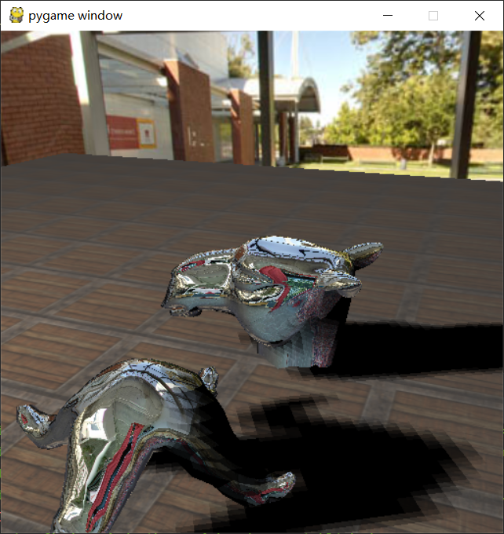

### How to run the code:

```
conda create -n game-engine python=3.6
conda activate game-engine

conda install pytorch==1.8.0 torchvision==0.9.0 torchaudio==0.8.0 cudatoolkit=10.2 -c pytorch
conda install -c conda-forge igl

conda install imageio
pip install PyOpenGL==3.1.4 PyOpenGL-accelerate==3.1.4 pygame==1.9.6

python main.py
```

### Run Sample


### Features

* Rendering
    - [x] PCF Shadow
    - [x] Sky Box
    - [ ] Transparent Object Rendering 
    - [ ] PRT
    - [ ] Deferred Rendering
    - [ ] Depth of Field for Camera
    - [ ] SSAO
    - [ ] TAA
    - [ ] PRT
    - [ ] Motion Blur
    - [ ] Complex Light Source
    
* Simulation
    - [x] FFT Ocean
    - [ ] Cloth Simulation
    - [ ] General Fluid Simulation
    - [ ] LBM Fluid Simulation
    - [ ] Deformable Object Simulation
    - [ ] Collision Detection
    
* Game Design